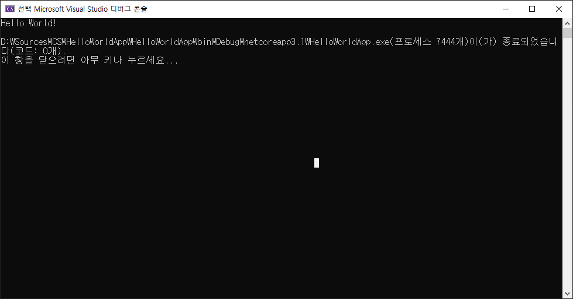

# HTML 학습 리포지토리
HTML5 CSS3, JS 학습용 리포지토리

>마크다운은 일반 텍스트 기반의 경량 마크업 언어다. 일반 텍스트로 서식이 있는 문서를 작성하는 데 사용되며, 일반 마크업 언어에 비해 문법이 쉽고 간단한 것이 특징이다.
## HTML5
HTML 기본학습

### HTML이란?
개요에 대해서 학습합니다 
1. Hyper Text Markup Language 정의
2. HTML 역사
3. HTML5의 차이점

- Hyper Text Markup Language 정의
- __HTML__ _역사_
- **HTML5의 ~차이점~**
  - UL2
    - SUL3
    - SUL4

```csharp
using System.IO;

namespace HelloWorldApp {
  public class Program {
    pulic static vodi Main(String[] arg) {
      Console.WriteLine("Hellow, World!")
      //Hello!!
    }
  }
}
```




</img><br/>

참조링크
-------------

- [Google](https://google.com, "google로 이동")
- [Naver](https://naver.com)
- [Google](https://google.com, "google link")

-------------------

## CSS3
CSS 기본 학습

>CSS is Cascading Style Sheets

`테스트 코드`

-------------------

## Javascript
Javascript 기본 학습

-------------------

## Responsive Web
문답형 웹 기본 학습

------------------

## Project
전체 통합 프로젝트

문의메일 : <vustkdgus@naver.com>
